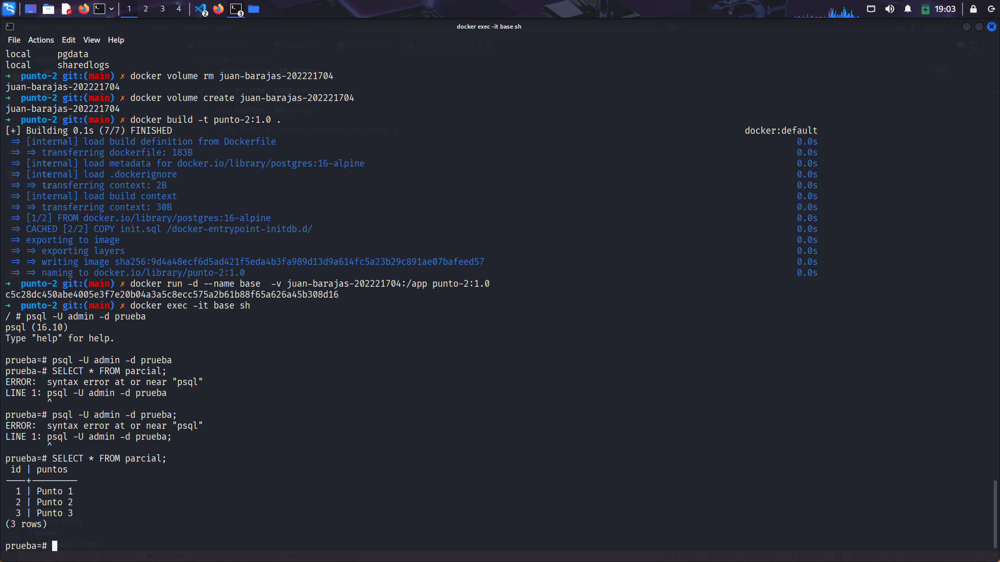
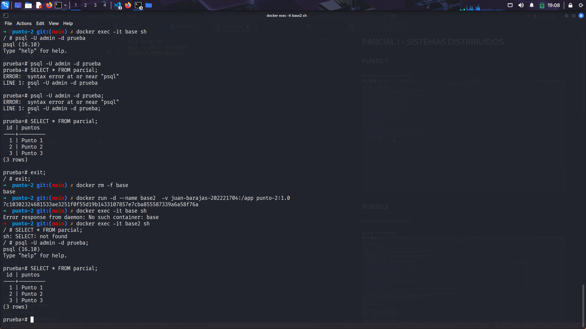
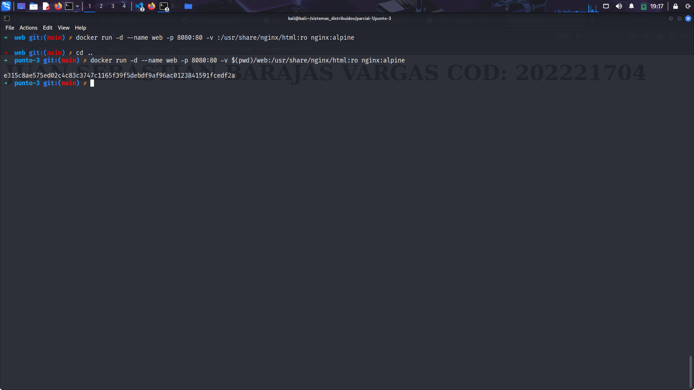
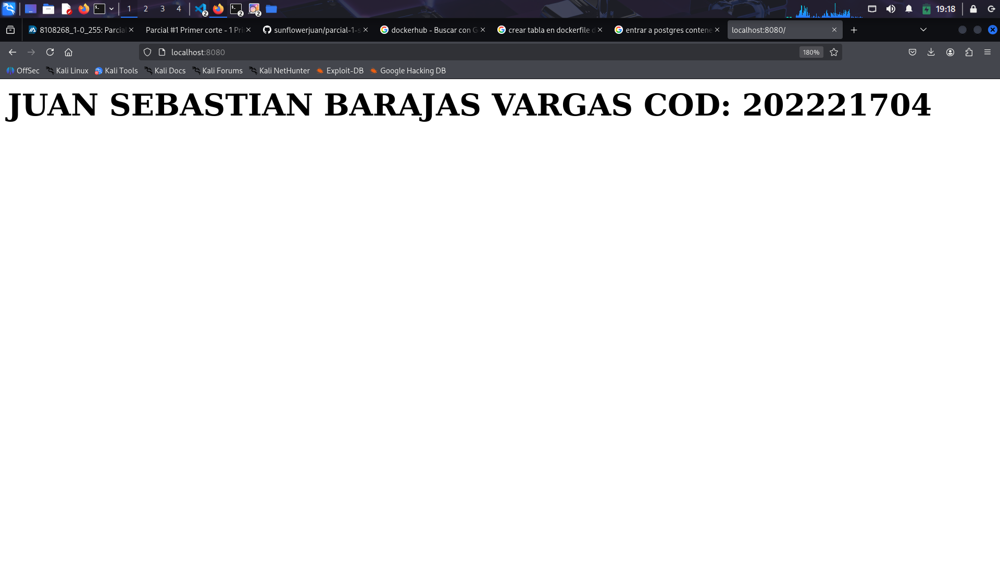
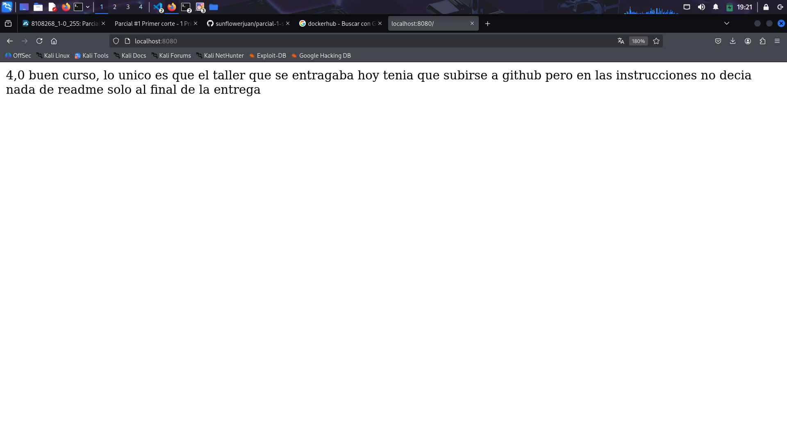
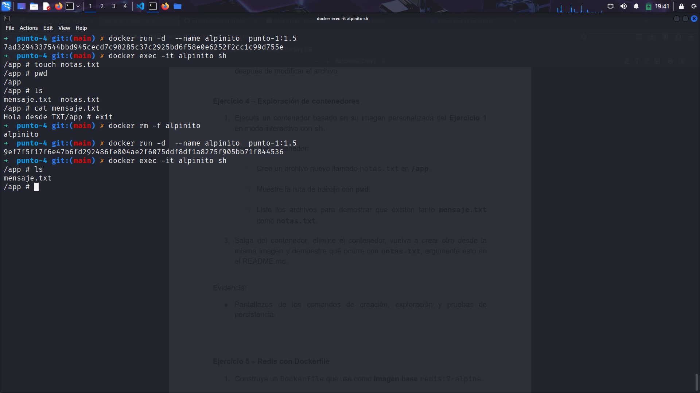
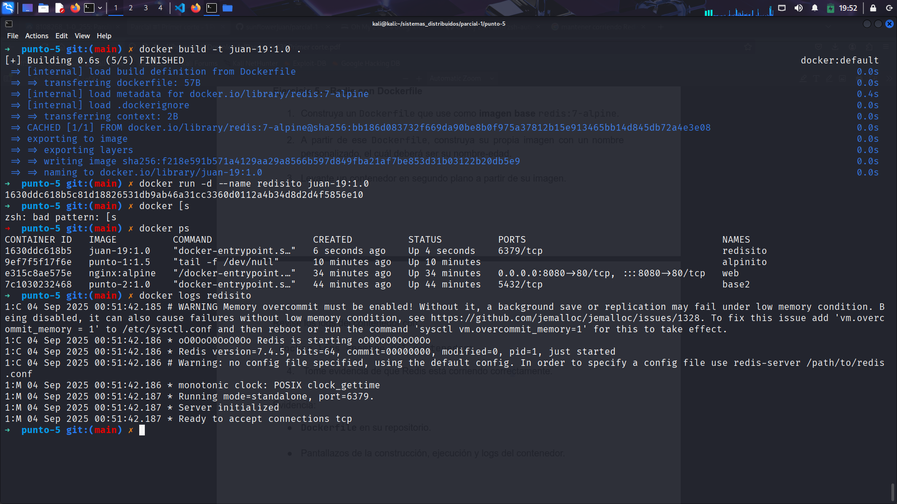

# PARCIAL I - SISTEMAS DISTRIBUIDOS

## PUNTO 1

Evidencia de screenshoot

## PUNTO 2

Evidencia de screenshoot

primer contenedor

segundo contenedor

## PUNTO 3

Evidencia de consola

Evidencia de navegador antes

Evidencia de navegador despues

## PUNTO 4

Evidencia de screenshoot

### Justificacion

notas txt se borra debido a que no hemos configurado ningun tipo de persistencia, volumen etc que mapee ese archivo y lo mantenga

## PUNTO 5

Evidencia de screenshoot

